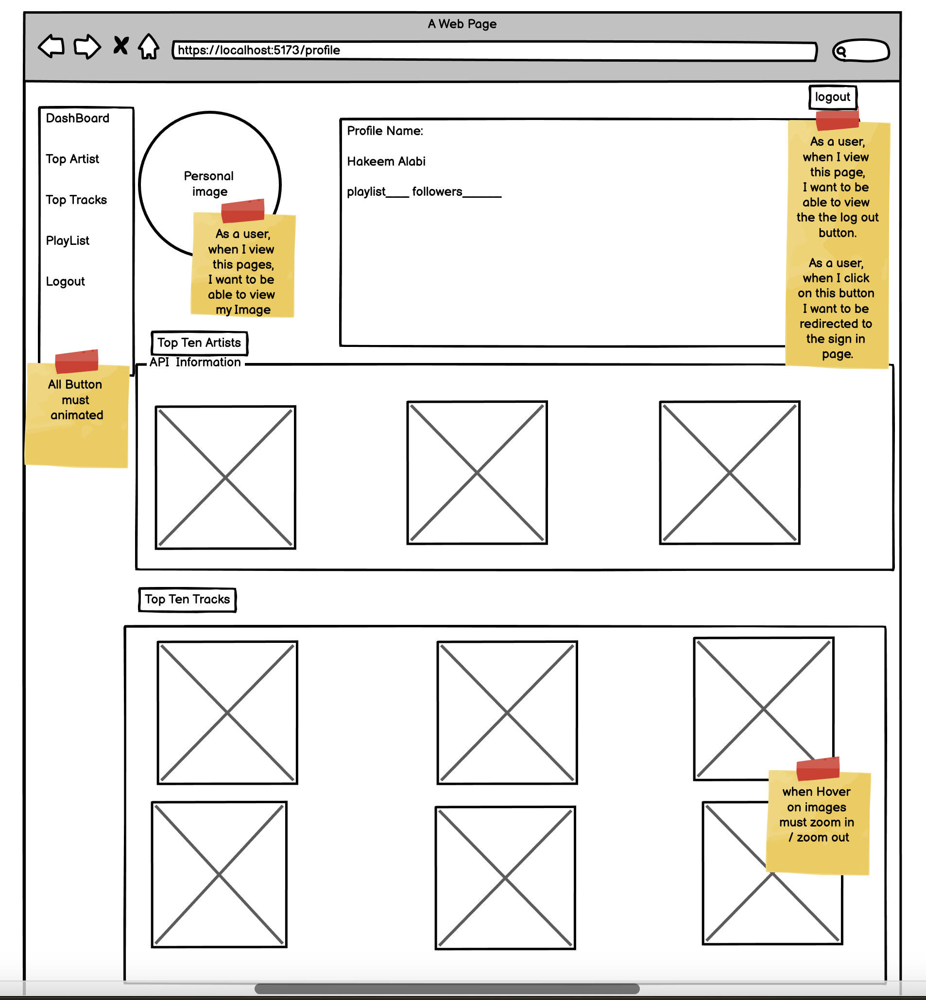
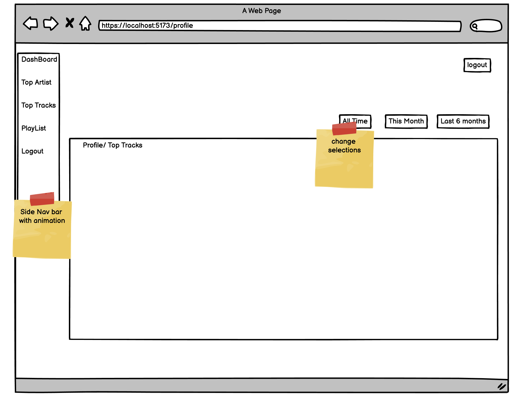
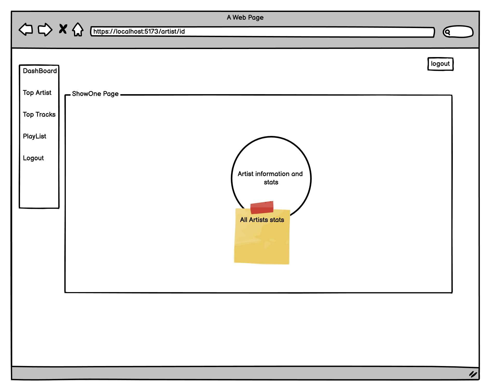

# Getting Started with Create React App

# Hakeem Spotify Personal Dashboard

## Introduction

In this project, I built and deployed a full-stack Dashboard web application that integrates with the Spotify Web API.

My Spotify web to visualize personalized Spotify data with the help of Node.js, Express, React, JavaScript, CSS, HTML, Styled with Tailwind CSS Components, and the Spotify API


## Local Installation & Set Up

1. Register a Spotify App in your [Spotify Developer Dashboard](https://developer.spotify.com/dashboard/) and add `http://localhost:8000/callback` as a Redirect URI in the app settings

2. Create a {.env} file at the root of the project based on {.env.example} 
3. Add your unique `CLIENT_ID` and `CLIENT_SECRET` from the Spotify dashboard
4. Installed globally [nvm] and [npm]
5.  Install ```shell nvm install```
6. Install dependencies```shell npm install ```
7. 
6. Run the React app on <http://localhost:5173/login> and the Node server on <http://localhost:8000>

    ```shell
    npm start
    ```
## Wireframe





